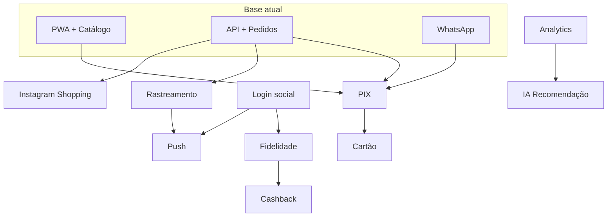

# Roadmap — Melhorias premium futuras · Le Maia

Visão de evolução do catálogo para uma **plataforma de vendas e relacionamento** completa, mantendo a identidade premium (bolsas personalizadas, WhatsApp, PWA).

**Legenda**

| Campo | Significado |
|-------|-------------|
| **Prioridade** | P0 = curto prazo alto impacto · P1 = médio prazo · P2 = longo prazo / diferencial |
| **Complexidade** | Baixa · Média · Alta · Muito alta |
| **Benefício** | Impacto esperado no negócio e na experiência |
| **Escalabilidade** | Capacidade de crescer sem reescrever a base |

---

## Matriz resumida

| # | Funcionalidade | Prioridade | Complexidade | Benefício | Escalabilidade |
|---|----------------|------------|--------------|-----------|----------------|
| 1 | **PIX (checkout)** | P0 | Média | Conversão imediata no Brasil; reduz fricção pós-carrinho | Alta — gateway plugável |
| 2 | **Analytics avançado** | P0 | Média | Decisões de estoque, campanhas e UX baseadas em dados | Alta — eventos + BI |
| 3 | **Rastreamento de pedidos** | P0 | Média | Confiança pós-compra; menos suporte manual | Alta — status + notificações |
| 4 | **Push notifications (PWA)** | P1 | Média | Reengajamento (promo, carrinho, pedido) sem app nativo | Alta — já há PWA |
| 5 | **Cartão (crédito/débito)** | P1 | Alta | Público que não usa PIX; parcelamento | Alta — mesmo checkout unificado |
| 6 | **Login social** | P1 | Média | Onboarding rápido; perfil e favoritos na nuvem | Alta — OAuth padrão |
| 7 | **Programa de fidelidade** | P1 | Alta | Retenção e LTV; marca premium recorrente | Média — regras de negócio |
| 8 | **IA — recomendação de produtos** | P1 | Alta | Descoberta personalizada; ticket médio | Alta — modelo evolutivo |
| 9 | **Integração Instagram Shopping** | P1 | Média–Alta | Tráfego social → catálogo; tag de produtos | Média — depende Meta |
| 10 | **Cashback** | P2 | Alta | Incentivo de recompra; concorrência com marketplaces | Média — ledger financeiro |
| 11 | **Assinatura / clube Le Maia** | P2 | Alta | Receita recorrente; lançamentos exclusivos | Média |
| 12 | **AR — “ver na foto” / provador virtual** | P2 | Muito alta | Diferencial premium em bolsas | Baixa inicialmente |
| 13 | **Chat IA (personalização)** | P2 | Alta | Escala atendimento WhatsApp; sugere combinações | Alta |
| 14 | **Marketplace B2B (revendedoras)** | P2 | Muito alta | Novo canal sem perder marca | Baixa no início |

---

## Detalhamento por iniciativa

### 1. PIX (checkout)

| Dimensão | Avaliação |
|----------|-----------|
| **Prioridade** | **P0** — método dominante no Brasil; complementa fluxo WhatsApp |
| **Complexidade** | **Média** — PSP (Mercado Pago, Stripe BR, Asaas, PagSeguro) + webhook + tela de confirmação |
| **Benefício** | Fecha venda no próprio catálogo; QR Code / copia-e-cola; menos abandono |
| **Escalabilidade** | **Alta** — abstração `PaymentProvider`; pedidos já existem no Prisma |

**Dependências:** conta PSP, `orders` com status de pagamento, idempotência de webhook, HTTPS (já previsto no deploy).

**Fases sugeridas:** carrinho → checkout PIX → confirmação automática → e-mail/WhatsApp de confirmação.

---

### 2. Analytics avançado

| Dimensão | Avaliação |
|----------|-----------|
| **Prioridade** | **P0** — base para priorizar todo o roadmap |
| **Complexidade** | **Média** — camada de eventos + dashboard (admin ou ferramenta externa) |
| **Benefício** | Funil (view → favorito → carrinho → pedido), produtos mais vistos, origem de tráfego |
| **Escalabilidade** | **Alta** — `product.viewCount` já existe; expandir para eventos genéricos |

**Stack sugerida:** PostHog / Plausible / GA4 (front) + tabelas `analytics_events` (back) + painel admin.

**Métricas-chave:** conversão por categoria, taxa de clique WhatsApp, tempo no catálogo, A/B de banners.

---

### 3. Rastreamento de pedidos

| Dimensão | Avaliação |
|----------|-----------|
| **Prioridade** | **P0** — expectativa mínima em e-commerce premium |
| **Complexidade** | **Média** — status (`pending` → `paid` → `production` → `shipped` → `delivered`) + timeline na UI |
| **Benefício** | Transparência; reduz “cadê meu pedido?” no WhatsApp |
| **Escalabilidade** | **Alta** — integração futura com Melhor Envio / Correios via API |

**Extras:** código de rastreio, link externo, notificação push/e-mail por mudança de status.

---

### 4. Push notifications (PWA)

| Dimensão | Avaliação |
|----------|-----------|
| **Prioridade** | **P1** — PWA já implementado; alto ROI de reengajamento |
| **Complexidade** | **Média** — Web Push (VAPID) + preferências do usuário + fila de envio |
| **Benefício** | Carrinho abandonado, promoções, pedido enviado, novos lançamentos |
| **Escalabilidade** | **Alta** — serviço de notificações desacoplado (OneSignal ou próprio) |

**Cuidados:** opt-in LGPD, frequência baixa (marca premium), segmentação.

---

### 5. Cartão (crédito / débito)

| Dimensão | Avaliação |
|----------|-----------|
| **Prioridade** | **P1** — após PIX estável |
| **Complexidade** | **Alta** — PCI (usar checkout hospedado), antifraude, parcelas, estornos |
| **Benefício** | Parcelamento; clientes sem PIX; ticket médio maior |
| **Escalabilidade** | **Alta** — mesmo orquestrador de pagamentos do PIX |

**Recomendação:** Stripe / Mercado Pago Checkout Pro — não armazenar cartão no backend próprio.

---

### 6. Login social

| Dimensão | Avaliação |
|----------|-----------|
| **Prioridade** | **P1** — favoritos hoje são localStorage; nuvem aumenta retenção |
| **Complexidade** | **Média** — NextAuth / Clerk: Google, Apple, Instagram (Meta) |
| **Benefício** | Perfil, histórico, favoritos e pedidos sincronizados; base para fidelidade |
| **Escalabilidade** | **Alta** — tabela `users` já prevista no schema |

**Integração:** migrar `le-maia-favorites` local → API `/api/favorites` autenticada.

---

### 7. Programa de fidelidade

| Dimensão | Avaliação |
|----------|-----------|
| **Prioridade** | **P1** — diferencial de marca, não commodity |
| **Complexidade** | **Alta** — pontos por compra, níveis (Bronze/Prata/Ouro), regras, expiração |
| **Benefício** | Recompra, sensação VIP, alinhado a “premium” |
| **Escalabilidade** | **Média** — ledger de pontos + jobs de expiração; testar regras antes de escalar |

**Ideias Le Maia:** pontos em personalizações, bônus em aniversário, acesso antecipado a coleções.

---

### 8. Cashback

| Dimensão | Avaliação |
|----------|-----------|
| **Prioridade** | **P2** — após fidelidade ou em paralelo simplificado |
| **Complexidade** | **Alta** — saldo virtual, uso parcial no checkout, conciliação contábil |
| **Benefício** | Incentivo direto à próxima compra |
| **Escalabilidade** | **Média** — exige controles financeiros e suporte |

**Alternativa P1:** cupom automático pós-compra (% fixo) — complexidade **média**, benefício similar.

---

### 9. IA — recomendação de produtos

| Dimensão | Avaliação |
|----------|-----------|
| **Prioridade** | **P1** — “Você também pode gostar” já existe; evoluir para personalizado |
| **Complexidade** | **Alta** — embeddings, histórico, cold start, custo de API |
| **Benefício** | Cross-sell inteligente; descoberta de coleções |
| **Escalabilidade** | **Alta** — começar com regras + categorias; depois ML/OpenAI embeddings |

**Fases:** (1) relacionados por categoria + vendas · (2) histórico de views · (3) modelo personalizado.

---

### 10. Integração Instagram Shopping

| Dimensão | Avaliação |
|----------|-----------|
| **Prioridade** | **P1** — marca visual forte no Instagram |
| **Complexidade** | **Média–Alta** — Catálogo Meta, pixel, tag de produtos, sync de estoque/preço |
| **Benefício** | Tráfego qualificado; compra sem sair do ecossistema Meta |
| **Escalabilidade** | **Média** — sync bidirecional aumenta complexidade |

**Pré-requisitos:** domínio verificado, feed de produtos (XML/CSV ou API), políticas Meta Commerce.

---

## Priorização recomendada (trimestres)

### Trimestre 1 — Conversão e confiança
1. PIX  
2. Analytics avançado  
3. Rastreamento de pedidos  

### Trimestre 2 — Retenção e alcance
4. Push notifications  
5. Login social + favoritos na nuvem  
6. Instagram Shopping (catálogo + pixel)  

### Trimestre 3 — Monetização e inteligência
7. Cartão + checkout unificado  
8. IA recomendações (fase 2)  
9. Programa de fidelidade (MVP)  

### Trimestre 4 — Diferenciais premium
10. Cashback ou cupons inteligentes  
11. Chat IA para personalização  
12. Clube / assinatura (piloto)  

---

## Mapa de dependências

---

## Riscos e mitigação

| Risco | Mitigação |
|-------|-----------|
| Escopo de pagamentos (PCI, chargeback) | PSP hospedado; nunca guardar dados de cartão |
| LGPD (login, push, analytics) | Consentimento, política de privacidade, DPO se escalar |
| Custo de IA | Cache, regras simples primeiro, batch offline |
| Sync Instagram / estoque | Job agendado + fila; fonte única no Prisma |
| Complexidade fidelidade + cashback | Lançar um mecanismo por vez; ledger único de “créditos” |

---

## Critérios para subir prioridade

- **P0 → implementar agora:** impacto direto em receita ou suporte operacional em &lt; 4 semanas de dev.
- **P1:** depende de P0 ou desbloqueia várias features (ex.: login antes de fidelidade).
- **P2:** diferencial competitivo; validar com clientes beta antes de investimento alto.

---

## Referência rápida — o que já existe no projeto

| Capacidade | Status |
|------------|--------|
| PWA instalável | ✅ |
| Carrinho local | ✅ |
| Favoritos local + API | ✅ parcial |
| Pedidos (schema) | ✅ |
| Admin produtos/pedidos | ✅ |
| WhatsApp checkout | ✅ |
| SEO + performance | ✅ |
| Pagamentos PIX/cartão | ❌ |
| Login / conta | ❌ |
| Push | ❌ |
| Fidelidade / cashback | ❌ |
| Rastreamento UI | ❌ |
| IA recomendação | ❌ básico (relacionados) |
| Instagram Shopping | ❌ |

---

*Documento vivo — revisar a cada release major. Última atualização: roadmap inicial pós-MVP (Prompts 1–16).*
